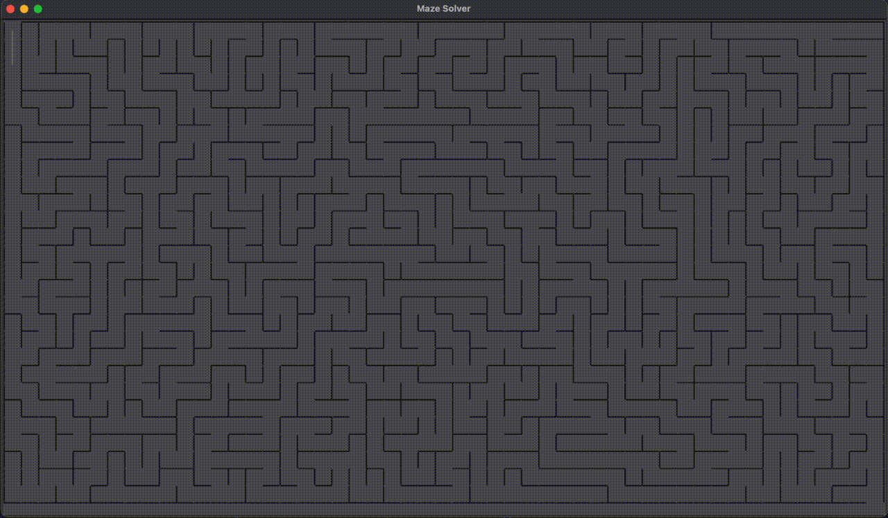

# Maze Generator & Solver

A maze generator and solver built with Python and the tkinter GUI library. A fun little project for visuzalizing pathfinding algorithms. Includes dfs, bfs, djikstra's, and a* solvers. The project is a bit rough around the edges :)

<picture>
    
</picture>

## Usage and Installation
#### Clone the Repository
```bash
git clone https://github.com/austin-weeks/maze-solver.git

cd maze-solver
```
#### Run the Solver
You can run the solver by running `main.py`:
```bash
python3 main.py
```
Or with the included `run` script:
```bash
chmod +x run

./run
```
You can alter the program's settings, such as window and maze size, by changing the arguments of the `Window` and `Maze` constructors in `main.py`. Here you can also change the algorithm used to solve the maze, by chaning the argument given to the `maze.solve()` method.